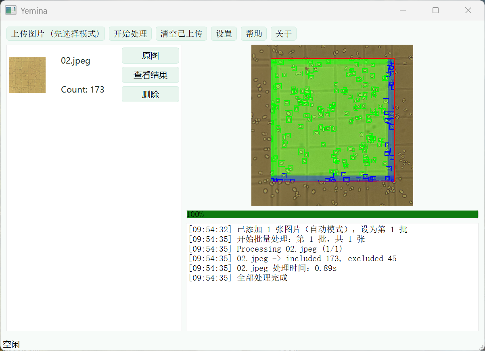
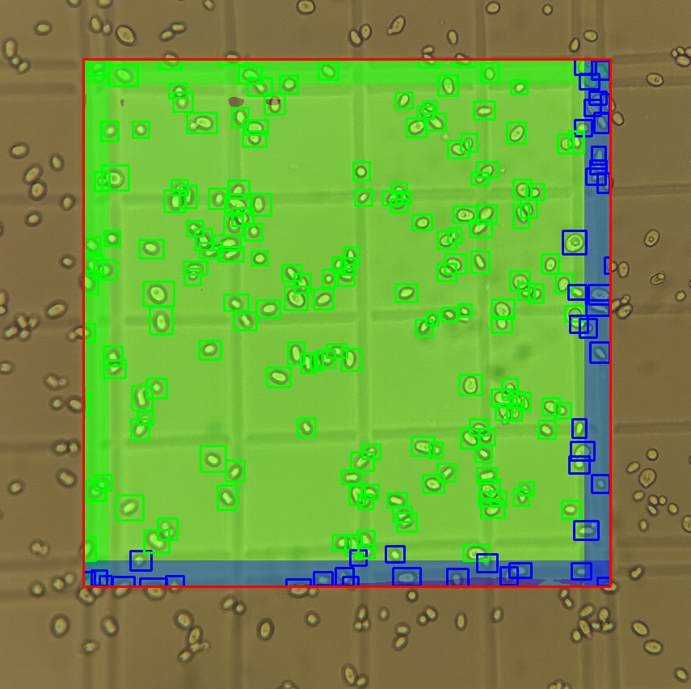

# Yemina
Yemina is an automated cell counting software that quickly and accurately identifies the central grid area of a hemocytometer and performs cell counting.

  
  

  <em>Left: Software UI | Right: Processing Details</em>

The software manual can be found in the readme.pdf.

